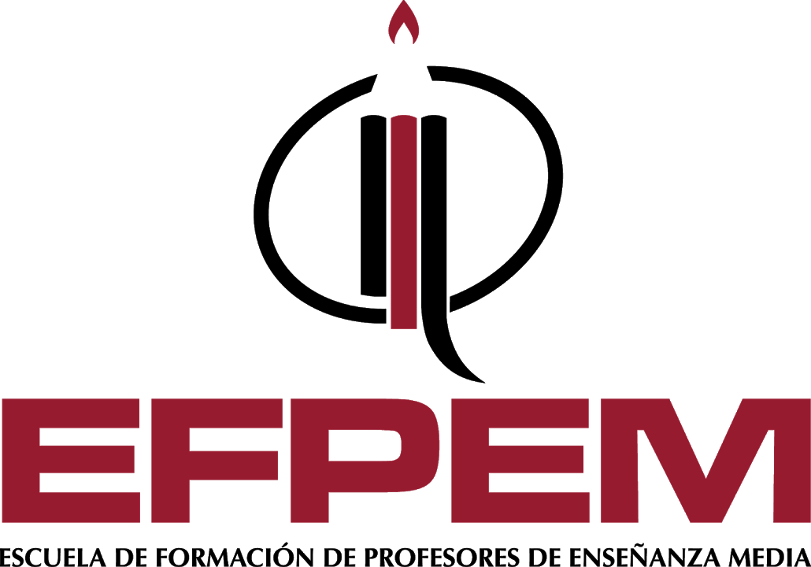

# ProgramasPython
Ejemplos de programas de python
<h2>Creado por:</h2>
 
<h2>Elvert Francisco Orellana Samayoa</h2>
 
<h2>Carnet:</h2>
 
<h2>USAC-EFPEM</h2>

 
<a href="labora2.py">Primer programa</a>
<a href="paipon.py">Segundo progrma</a>
<a href="persona.py">Tercer progrma</a>
